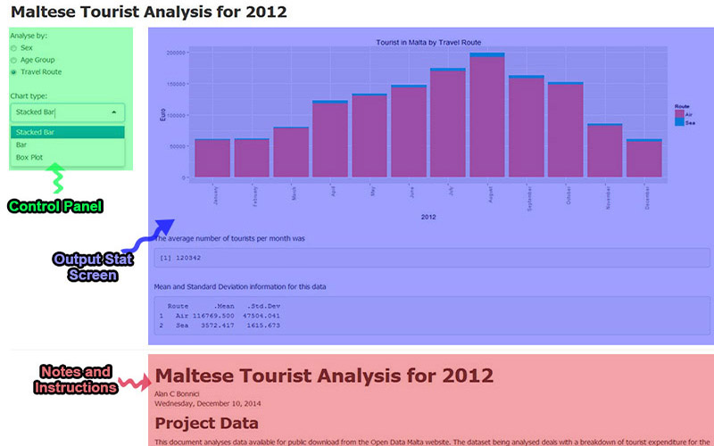

# Maltese Tourist Analysis for 2012
Alan C Bonnici  
Wednesday, December 10, 2014  

## Project Data

This document analyses data available for public download from the Open Data Malta website. The dataset being analysed deals with a breakdown of tourist expenditure for the year 2012 by Sex, Age Group and Travel Route (sea or air).

The user of the shiny app can look at each of these data subsets graphically. For each topic three graphs are available:

* Bar Chart
* Stacked Bar Chart
* Box Plot

Computed is the average number of tourists per month.

Depending on the data set being analysed, the app computes descriptive statistics on that data set.

======================================================================================================

The data is publicly available from http://www.opendatamalta.org/ckan/dataset/50cfd96f-246e-4d57-a0ce-86c8ce88e9d6/resource/fad12a26-2965-404f-9320-c0bc82353315/download/Profileofdepartingtourists2012.csv. It was downloaded on **10 December 2014**.

The data had to be cleaned up and reprocessed in order to get it into a format that is usable in this app.

## How to use the app

The screen is split into three parts.

The Control Panel is the place from where you control this app. Results are displayed in the Output Stat Screen. The Notes and Instructions section of this app contains information about this solution as well as information on how to run it (this file).

## Presentation

The slide show presentation of this app can be viewed at <a href="http://rpubs.com/chribonn/devdataprod-016" target="_blank">http://rpubs.com/chribonn/devdataprod-016</a>. This was created using **R Presentation**.

## Code Reproducability

The code that downloads the raw data, cleans it up and prepares it for this app forms part of the github repo at https://github.com/chribonn/devdataprod-016/.

This repo contains all the code and data making up this solution. The files and folders are the following:

1  **README.md** - Text file that lists the project question and points to this file.  
2  **/code/code.R** - The code that was used to download and clean up the data.  
3  */data* - The source data used in this project.  
4  */shiny* - The code used in the creation of the shiny solution.  
5  */presentation* - The R Markdown used to create the RStudio Presenter presentation.  
6  */support* - Other files used in the creation of the solution.  
